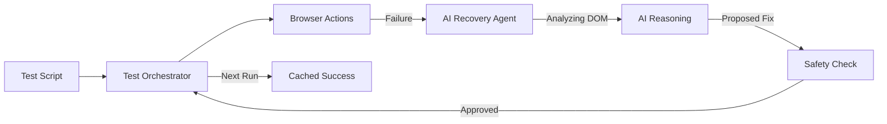

# 🧪 Agentic Playwright Framework
> **Self-Healing End-to-End Test Automation**

## 🌟 Overview
This framework enhances standard Playwright E2E tests with an **Agentic Recovery Layer**. It uses AI (Google Gemini, OpenAI) to automatically repair broken selectors during test execution, ensuring your CI/CD pipelines remain green even when the UI changes.

## 🚀 Key Benefits
- **Zero Flakiness**: Automatically recovers from "Element Not Found" errors mid-flight.
- **Low Maintenance**: No more manual updates to CSS selectors or IDs after every UI redesign.
- **Cost Efficient**: Integrated **Selector Memory** ensures the AI is only called once per "healing" event; subsequent runs use the cached fix instantly.
- **Production Safety**: A built-in **Policy Engine** prevents the AI from taking low-confidence or unsafe actions.

---

## 🏗️ Architecture & Workflow



---

## 🛠️ How it Works: The "Healing" Lifecycle

1.  **Detection**: A test step (e.g., `orchestrator.click('.old-id')`) fails because the UI was updated.
2.  **Context Capture**: The framework captures a snapshot of the current HTML and Accessibility Tree.
3.  **AI Reasoning**: The AI analyzes the intent (e.g., "The Login Button") and finds the most likely new candidate in the updated DOM.
4.  **Auto-Correction**: The framework applies the new selector and continues the test without a restart.
5.  **Report Generation**: A detailed **Healing Report** is created with "Before/After" screenshots and AI reasoning.

---

## 💻 Sample Code (Self-Healing in Action)

Instead of complex fragile selectors, we write tests that focus on **user intent**.

```javascript
// tests/e2e/add-to-cart.spec.js
test('Complete Shopping Flow', async ({ page }) => {
  const test = new TestOrchestrator(page, 'demo-001');

  // Even if this ID changes, the AI will find the input based on labels
  await test.fill('#user-email-v1', 'user@example.com', {
    description: 'Email address input field' 
  });

  await test.fill('#pass', 'secure-password');
  await test.click('button:has-text("Sign In")');

  // If this CSS class is removed, the AI heals it to the text "Add to cart"
  await test.click('.btn-primary-add', {
    description: 'The primary add-to-cart button'
  });
});
```

---

## 📊 Telemetry & Reporting
Every run generates an artifacts folder in `test-results/healing-artifacts/`:
- **`healing-report.md`**: A summary of all "Heals" performed.
- **`selector-memory.json`**: The persistent knowledge base of repaired code.
- **Screenshots**: Visual proof of every recovery event.

---

## 🛠️ Getting Started for the Team
1.  **Install Dependencies**: `npm install`
2.  **Configure API Keys**: Add `GOOGLE_API_KEY` or `OPENAI_API_KEY` to `.env`.
3.  **Run with Healing**:
    ```bash
    # Run tests with real-time AI healing
    npx playwright test tests/e2e/add-to-cart-healing.spec.js --headed
    ```

---
*Developed for Agentic Test Automation Excellence.*
