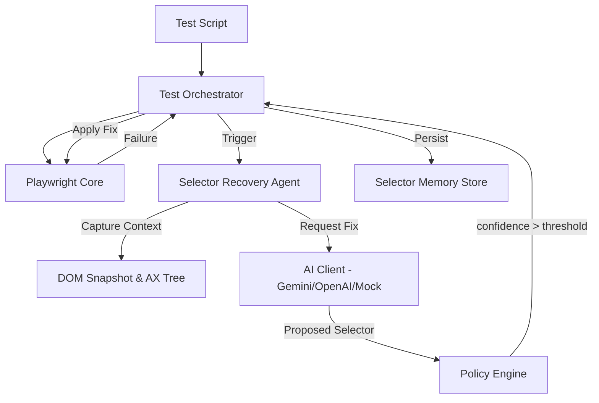

# 🧠 Agentic Playwright Framework: Code Deep Dive

This document provides a comprehensive technical breakdown of the self-healing E2E framework. The architecture is designed to make tests resilient to UI changes by injecting an AI-powered "recovery layer" between the test script and the browser.

---

## 🏗️ 1. Architecture Overview

---

## 🔧 2. Core Components Deep Dive

### 🧠 Test Orchestrator (`src/core/test-orchestrator.js`)
The **Brain** of the framework. It wraps every Playwright action (click, fill, select) in a recoverable unit.
*   **Action Wrapping**: Instead of `page.click()`, we use `orchestrator.click()`. This allows the framework to intercept exceptions.
*   **Healing Loop**: If an action fails, it enters a structured recovery loop:
    1.  Capture Screenshot & DOM.
    2.  Invoke Recovery Agent.
    3.  Evaluate Policy decision.
    4.  Apply healed selector.
*   **Locator Resolution**: A custom resolver that supports standard CSS/XPath plus Playwright's `getBy*` syntax stringified.

### 🔍 Selector Recovery Agent (`src/agents/selector-recovery-agent.js`)
The **Solver**. Its job is to analyze the failure and find a replacement.
*   **Context Gathering**: Uses `DomSnapshotTool` and `AccessibilityTreeTool` to provide the AI with a limited but relevant view of the page.
*   **Prompting Strategy**: Sends the "Target Description" (intent) to the AI, asking it to find the best candidate in the current HTML that matches that intent.
*   **Confidence Scoring**: Every recommendation comes with a 0.0 to 1.0 confidence score.

### 🤖 AI Client (`src/agents/ai-client.js`)
The **Interface**. A unified wrapper for multiple AI providers.
*   **Multi-Provider**: Support for `google` (Gemini), `openai` (GPT-4), `groq` (Llama), and `mock`.
*   **Resiliency**: Built-in retry logic for `429 Rate Limit` errors with exponential backoff.
*   **Mock Mode**: A specialized "demo" mode that returns high-confidence fixes for specific known broken selectors to ensure reliable demonstrations without API dependency.

### 🛡️ Policy Engine (`src/core/policy-engine.js`)
The **Guardrail**. Ensures the AI doesn't perform "hallucinated" actions.
*   **Strict vs. Adaptive**: In `strict` mode, only 0.95+ confidence is applied. In `adaptive`, it may try medium-confidence fixes.
*   **Safety Checks**: Prevents the AI from interacting with sensitive fields (sensitive attributes like `password` are redacted from context).

---

## 🔄 3. The Self-Healing Algorithm

1.  **Detection**: `page.click('.btn')` times out.
2.  **Context**: Agent reads the HTML block and confirms `.btn` is gone but a `<button>` with text "Submit" exists.
3.  **Inference**: AI recommends `button:has-text("Submit")`.
4.  **Verification**: The framework performs a "soft check" to see if the new selector actually resolves to an element.
5.  **Execution**: The test clicks the new button and logs: `[HEALED] .btn -> button:has-text("Submit")`.
6.  **Learning**: The fix is saved to `selector-memory.json`. Next time, the test uses the fix **immediately**.

---

## 📁 4. Project Structure

| Path | Purpose |
| :--- | :--- |
| `config/` | Framework settings, AI models, and policy thresholds. |
| `src/core/` | The orchestration and policy logic. |
| `src/agents/` | AI prompting logic and client implementations. |
| `src/memory/` | JSON-based persistence for healed selectors. |
| `src/tools/` | Low-level utilities for DOM and Screenshot capture. |
| `tests/e2e/` | The actual test specs using the `TestOrchestrator`. |

---

## 🚀 5. E2E Flow Breakdown (`add-to-cart-healing.spec.js`)

This file demonstrates a multi-step sequence that recovers from **multiple failures**:

1.  **Step 1: Login**: Successfully navigates to the portal.
2.  **Step 2: Email (HEAL)**: Intentional broken ID `#user-login-email-field-v2` is healed to `input[type="email"]`.
3.  **Step 6: Add to Cart (HEAL)**: Intentional broken class `.custom-add-to-cart-action` is healed to `button:has-text("Add to cart") >> nth=0`.
4.  **Step 7: Verification**: The test confirms the "Remove" button is visible, proving the healed "Add to Cart" click was successful.

---

## 📈 6. Why This Framework?

*   **Zero-Maintenance**: Tests stay green even after minor UI redesigns.
*   **Readable Logs**: Instead of "TimeoutError", you get "Healed selector applied successfully".
*   **Offline Mode**: The Mock provider allows for zero-cost E2E demos.
*   **Production Ready**: Integrated policy engine prevents unsafe AI decisions.

---
*Created by Antigravity AI for Agentic Test Automation demos.*
