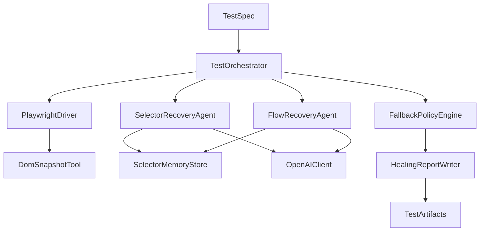
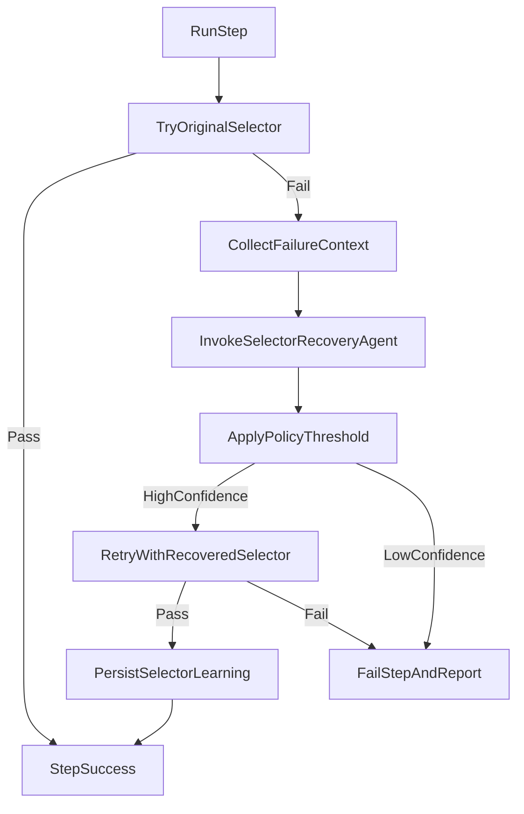
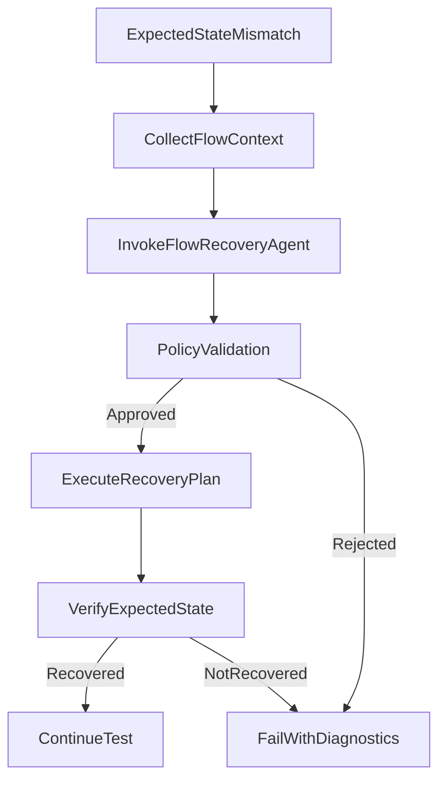

# Agentic Playwright Framework Design Document

## 1) Why This Framework Exists

You want UI automation that does not break every time a selector changes.
Traditional Playwright tests are reliable when selectors are stable, but brittle when:

- a CSS class changes,
- a button moves inside another container,
- labels or structure shift during UI redesign,
- a flow adds one extra screen (for example, consent or security prompts).

This framework adds agents on top of Playwright to make tests resilient. It keeps normal deterministic tests first, and only invokes agents when something fails. That balance gives you:

- the reliability of standard automation,
- the adaptability of LLM reasoning,
- clear governance so healing is controlled and auditable.

## 2) Goals

- Build a TypeScript + Node.js + Playwright framework.
- Use OpenAI-powered agents for selector and flow recovery.
- Auto-heal at runtime when safe, with confidence-based policies.
- Learn agent systems deeply as a QA engineer (not a black box).
- Produce rich artifacts so every heal can be reviewed and trusted.

## 3) Non-Goals (Initial Version)

- Full autonomous test generation from plain English.
- Replacing all manual test design.
- Auto-committing changed selectors directly to git without review.
- Visual diff testing as a primary healing mechanism.

## 4) Design Principles

- Deterministic first: try authored selectors and normal flow first.
- Agent as fallback: engage AI only after a concrete failure.
- Safety first: action allowlists and strict confidence gating.
- Explainability: every healing step must be logged and reproducible.
- Human override: CI can run strict mode to fail instead of heal.

## 5) High-Level Architecture



### Runtime Layers

1. **Execution Layer**: Playwright runner, page objects, fixtures.
2. **Agent Layer**: Selector and flow recovery agents.
3. **Policy Layer**: Confidence scoring and fail/continue decisions.
4. **Memory Layer**: Historical selector metadata and prior heal outcomes.
5. **Observability Layer**: Reports, traces, and quality dashboards.

## 6) Proposed Repository Layout

```text
Riya_ai/
  docs/
    agentic-playwright-framework-design.md
  src/
    core/
      test-orchestrator.ts
      policy-engine.ts
      confidence-scoring.ts
    agents/
      selector-recovery-agent.ts
      flow-recovery-agent.ts
      assertion-helper-agent.ts
      prompts/
        selector-system-prompt.md
        flow-system-prompt.md
    tools/
      dom-snapshot-tool.ts
      accessibility-tree-tool.ts
      screenshot-tool.ts
      network-log-tool.ts
    memory/
      selector-memory-store.ts
      flow-memory-store.ts
      run-context-store.ts
    telemetry/
      healing-report-writer.ts
      event-bus.ts
    types/
      contracts.ts
  tests/
    e2e/
      checkout.spec.ts
      login.spec.ts
  config/
    framework.config.ts
    policy.config.ts
```

## 7) End-to-End Runtime Flow

1. Test step runs with authored selector.
2. If step passes, continue normally.
3. If step fails with "element not found", trigger Selector Recovery Agent.
4. Agent gets constrained context:
   - current URL and page title,
   - DOM subset around expected area,
   - accessibility tree,
   - historical selector candidates,
   - action intent metadata (for example `click checkout`).
5. Agent proposes ranked selector candidates with confidence.
6. Policy engine decides:
   - auto-apply,
   - retry with additional context,
   - fail-fast.
7. On apply, Playwright retries action and validates post-condition.
8. Result is logged in healing report and memory store.
9. If whole flow diverges (unexpected page), Flow Recovery Agent attempts path correction.

## 8) Core Components and Responsibilities

## 8.1 TestOrchestrator

- Wraps each Playwright action in a recoverable execution unit.
- Routes failures to correct agent type.
- Maintains per-test `RunContext` state.
- Emits events to telemetry.

## 8.2 PlaywrightDriver

- Executes action primitives: click, fill, select, assert, wait.
- Captures baseline errors with structured metadata.
- Exposes deterministic retries before agent fallback.

## 8.3 DomSnapshotTool

- Produces compact, token-efficient context for agents.
- Redacts sensitive values (passwords, tokens, personal data fields).
- Can return:
  - target neighborhood nodes,
  - semantic attributes (`role`, `name`, `aria-*`, `data-testid`),
  - simplified tree path.

## 8.4 SelectorRecoveryAgent

- Purpose: recover the best selector for a failed step.
- Input: failure context + DOM/accessibility summary + memory.
- Output: list of candidates with rationale and confidence.
- Constraint: can only return selectors and read-only reasoning, no arbitrary actions.

## 8.5 FlowRecoveryAgent

- Purpose: recover from path-level drift (extra modal, changed routing, reordered steps).
- Input: expected flow state, observed state, recent step history.
- Output: minimal patch plan (next allowed actions) with confidence.
- Constraint: actions must come from allowlisted verbs.

## 8.6 PolicyEngine

- Enforces governance:
  - confidence thresholds,
  - max retries,
  - strict vs adaptive execution mode.
- Prevents risky behavior in CI by policy configuration.

## 8.7 Memory Stores

- **RunContextStore (short-term):**
  - stores context for current run only.
- **SelectorMemoryStore (long-term):**
  - stores successful selector alternatives and decay scores.
- **FlowMemoryStore (long-term):**
  - stores known detours and prior recoveries for similar drift.

## 8.8 HealingReportWriter

- Writes human-readable and machine-readable artifacts:
  - `healing-report.json`
  - `healing-report.md`
  - screenshots + traces
  - before/after selector mapping

## 9) Data Contracts (TypeScript)

```ts
export interface FailedStepContext {
  testId: string;
  stepId: string;
  action: "click" | "fill" | "select" | "assert";
  expectedTargetDescription: string;
  originalSelector?: string;
  url: string;
  domExcerpt: string;
  axTreeExcerpt: string;
  screenshotPath?: string;
  errorMessage: string;
}

export interface SelectorCandidate {
  selector: string;
  strategy: "role" | "label" | "testid" | "css" | "xpath";
  confidence: number; // 0 to 1
  rationale: string;
}

export interface SelectorRecoveryResult {
  candidates: SelectorCandidate[];
  recommendedSelector?: string;
  recommendedConfidence: number;
  shouldRetryWithMoreContext: boolean;
}

export interface FlowRecoveryAction {
  action: "click" | "fill" | "waitForURL" | "assertVisible" | "dismissModal";
  target?: string;
  value?: string;
  rationale: string;
}

export interface FlowRecoveryPlan {
  planId: string;
  confidence: number;
  actions: FlowRecoveryAction[];
  expectedStateAfterPlan: string;
}
```

## 10) Agent Tooling Model (OpenAI)

Use a tool-calling architecture where the model does reasoning and returns typed outputs.

- **OpenAI client wrapper** handles:
  - request building,
  - schema validation,
  - retries,
  - token/cost telemetry.
- **Structured outputs** guarantee parseable candidate lists/plans.
- **Model routing**:
  - lower-cost model for simple selector retries,
  - stronger reasoning model for flow recovery.

### Tool Interface Example: Selector Recovery

Input payload:

```json
{
  "testId": "checkout-001",
  "stepId": "click-place-order",
  "action": "click",
  "expectedTargetDescription": "Place Order button at checkout",
  "originalSelector": "[data-testid='place-order-btn']",
  "url": "https://app.example.com/checkout",
  "errorMessage": "Timeout 5000ms: locator not found",
  "domExcerpt": "<button aria-label='Confirm Purchase'>Confirm</button>",
  "axTreeExcerpt": "button name='Confirm Purchase'"
}
```

Expected output payload:

```json
{
  "candidates": [
    {
      "selector": "getByRole('button', { name: /confirm purchase/i })",
      "strategy": "role",
      "confidence": 0.91,
      "rationale": "Accessible name matches intended action"
    },
    {
      "selector": "button:has-text('Confirm')",
      "strategy": "css",
      "confidence": 0.67,
      "rationale": "Text partially matches but less specific"
    }
  ],
  "recommendedSelector": "getByRole('button', { name: /confirm purchase/i })",
  "recommendedConfidence": 0.91,
  "shouldRetryWithMoreContext": false
}
```

### Tool Interface Example: Flow Recovery

Input payload:

```json
{
  "expectedState": "On payment review screen",
  "observedState": "Security upsell modal is blocking page",
  "recentSteps": ["fill card", "click continue"],
  "url": "https://app.example.com/checkout/review"
}
```

Expected output payload:

```json
{
  "planId": "flow-recover-147",
  "confidence": 0.84,
  "actions": [
    {
      "action": "dismissModal",
      "target": "getByRole('button', { name: /not now/i })",
      "rationale": "Modal blocks expected page interactions"
    },
    {
      "action": "assertVisible",
      "target": "getByRole('heading', { name: /review order/i })",
      "rationale": "Confirms flow is back on expected screen"
    }
  ],
  "expectedStateAfterPlan": "Payment review screen available"
}
```

## 11) Healing Algorithms

## 11.1 Element-Level Healing



## 11.2 Flow-Level Healing



## 12) Confidence and Decision Matrix

Recommended baseline thresholds (tune per app):

- `>= 0.90`: auto-heal allowed in local and CI adaptive mode.
- `0.75 - 0.89`: auto-heal in local only; CI requires strict flag override.
- `< 0.75`: fail-fast, attach diagnostics, require human review.

| Scenario | Confidence | Environment | Decision |
|---|---:|---|---|
| Selector candidate with exact role/name match | 0.92 | Local | Auto-heal and continue |
| Selector candidate with partial text match only | 0.81 | CI strict | Fail-fast |
| Flow recovery includes single safe modal dismiss | 0.88 | CI adaptive | Apply once then verify |
| Flow recovery proposes 3+ state-changing actions | 0.72 | Any | Fail-fast |

## 13) Policy and Safety Guardrails

- **Action allowlist**: `click`, `fill`, `assertVisible`, `waitForURL`, `dismissModal`.
- **Action denylist**: destructive admin actions unless explicitly tagged safe in test metadata.
- **Max healing retries**:
  - selector retries per step: 2
  - flow recovery attempts per test: 1
- **No hidden persistence**: never auto-rewrite test files during execution.
- **PII controls**:
  - redact known sensitive fields from prompts/logs,
  - do not send full page HTML if unnecessary,
  - store masked artifacts by default.
- **Prompt injection resistance**:
  - ignore page text instructions,
  - treat DOM text as data, not system instructions.

## 14) Observability and Reporting

Capture these events:

- `step_failed`
- `selector_recovery_invoked`
- `selector_recovery_applied`
- `flow_recovery_invoked`
- `flow_recovery_applied`
- `heal_rejected_by_policy`
- `test_completed`

Minimum artifact set per failed/healed test:

- screenshot before recovery,
- screenshot after recovery,
- Playwright trace zip,
- model input hash and output schema,
- final decision and confidence.

KPIs to track weekly:

- healing success rate,
- false-heal rate (test passed but wrong behavior),
- flaky test reduction,
- top unstable pages/components,
- token and cost per 100 tests.

## 15) CI/CD Integration Model

Two execution modes:

- **Strict Mode (main branch):**
  - no medium/low confidence healing,
  - fail fast for uncertain recovery,
  - maximize trust.
- **Adaptive Mode (nightly/regression):**
  - allow medium confidence healing,
  - collect recovery insights to improve selectors.

Pipeline stages:

1. Install dependencies and browsers.
2. Run tests with framework policy config.
3. Publish healing artifacts and metrics.
4. Gate merge by strict mode pass criteria.

## 16) Learning-Centric Implementation Roadmap

## Phase 0: Baseline Playwright Skeleton

- Setup Playwright + TypeScript project.
- Add 2 stable reference test flows.
- Learn: fixtures, page objects, trace viewer.

Exit criteria:

- Tests run green in local and CI without agents.

## Phase 1: Recoverable Execution Wrapper

- Implement `TestOrchestrator` and structured step execution.
- Add failure context capture and telemetry events.
- Learn: resilient test architecture and event-driven design.

Exit criteria:

- Any failed step emits structured context artifact.

## Phase 2: Selector Recovery Agent (MVP)

- Implement `SelectorRecoveryAgent` with OpenAI structured outputs.
- Wire `DomSnapshotTool` + retry mechanism.
- Add confidence thresholds and policy checks.
- Learn: tool-calling patterns, schema-first LLM integration.

Exit criteria:

- Known selector-break scenarios auto-heal in local runs.

## Phase 3: Long-Term Selector Memory

- Persist successful selector alternatives with decay scoring.
- Prioritize historical success before fresh model calls.
- Learn: memory systems and retrieval ranking.

Exit criteria:

- Token usage drops; repeated failures heal faster.

## Phase 4: Flow Recovery Agent

- Detect state drift and invoke flow planner.
- Apply constrained action plans with verification checkpoints.
- Learn: planning agents, bounded autonomy, policy enforcement.

Exit criteria:

- At least one intentional flow drift scenario is recovered safely.

## Phase 5: CI Governance + Quality Gates

- Add strict/adaptive policy modes.
- Publish healing metrics and trends dashboard.
- Learn: trust engineering, reliability metrics for AI systems.

Exit criteria:

- Strict mode protects merges; adaptive mode provides learning insights.

## Phase 6: Hardening and Team Adoption

- Add docs, runbooks, and debugging playbook.
- Add training examples for QA team.
- Learn: operationalizing agentic systems across teams.

Exit criteria:

- Framework is reproducible by another QA engineer from docs alone.

## 17) Risks and Mitigations

1. **False healing (wrong element clicked)**
   - Mitigation: enforce post-action assertions, confidence thresholds, and strict mode in CI.

2. **Model cost growth**
   - Mitigation: memory-first strategy, context trimming, model routing by complexity.

3. **Prompt/data leakage**
   - Mitigation: redaction pipeline, minimal context, audit logging, retention controls.

4. **Over-reliance on AI and weaker test design**
   - Mitigation: keep authored selectors as primary, add lint checks for selector quality.

5. **Flaky recoveries due to timing**
   - Mitigation: deterministic waits and state assertions before/after healing.

## 18) MVP Acceptance Criteria

- Selector healing works for at least 3 intentionally broken selectors.
- Policy engine blocks low-confidence suggestions.
- Healing report shows every decision with reason and confidence.
- CI strict mode rejects uncertain healing.
- At least one flow-level drift scenario is recovered safely in adaptive mode.

## 19) How You Will Understand the System End-to-End

For each phase, keep a short "what I learned" log with:

- failure symptom,
- context captured,
- agent output,
- policy decision,
- final result.

This turns the project into both a production framework and your personal learning lab for agent architecture.

## 20) Next Build Order (Actionable)

1. Bootstrap Playwright TypeScript project structure in `src/` and `tests/`.
2. Implement `TestOrchestrator` + event bus + artifact writer.
3. Add selector recovery MVP with strict typed schemas.
4. Add policy engine + confidence matrix configuration.
5. Add memory layer and replay benchmarking.
6. Add flow recovery and CI dual-mode rollout.

Once these are implemented, this framework will provide resilient automation while teaching you exactly how production-grade agents are designed, constrained, observed, and trusted.
